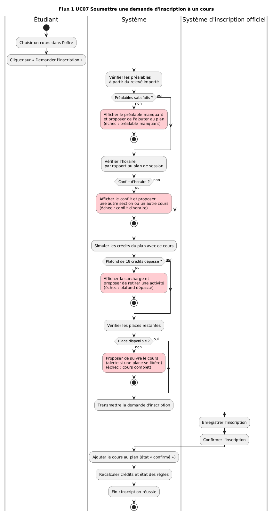
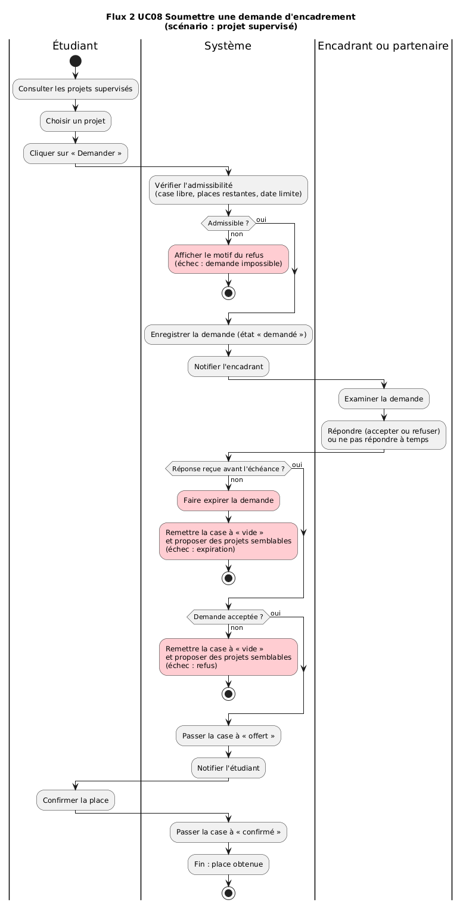
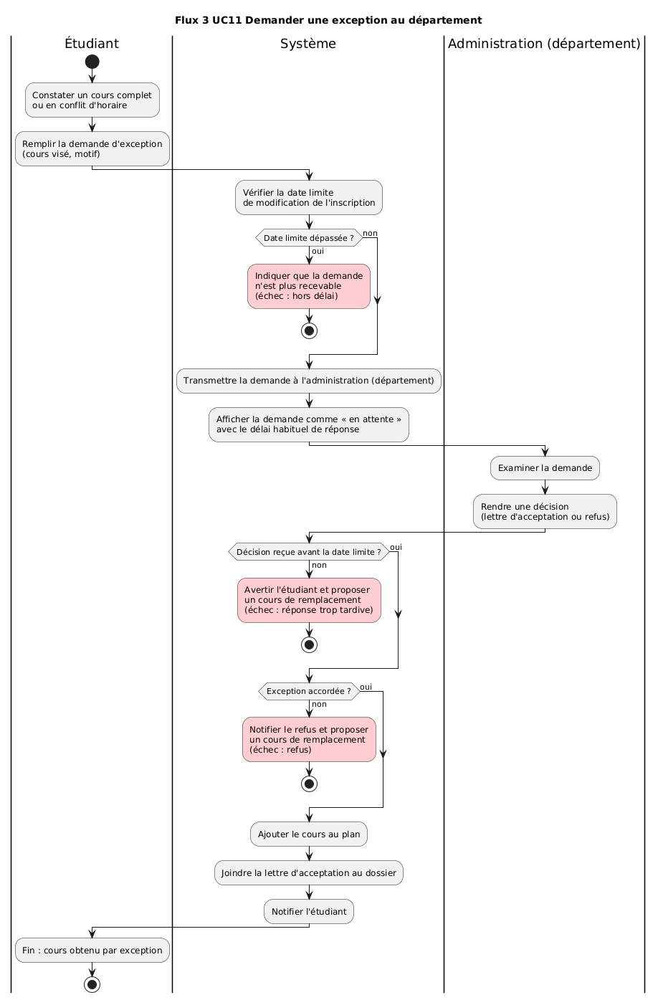
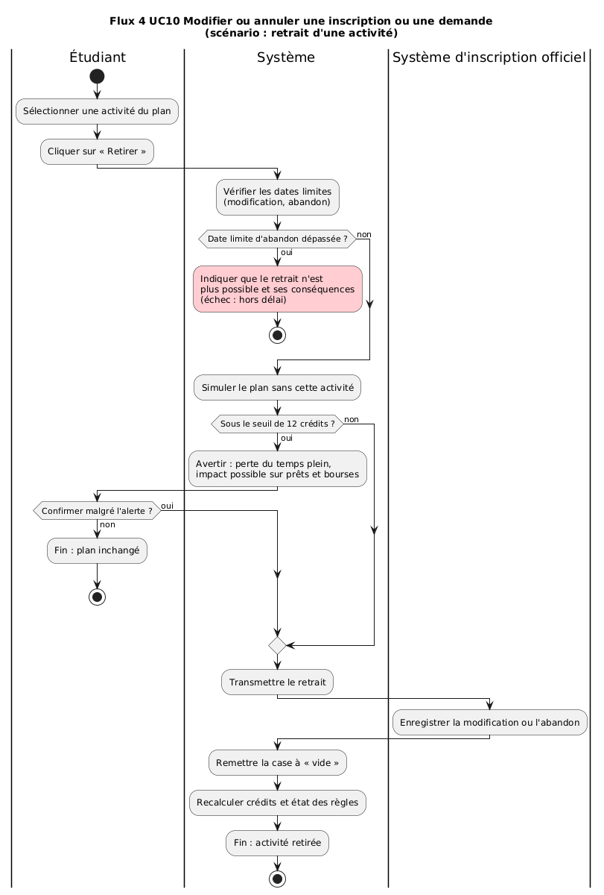
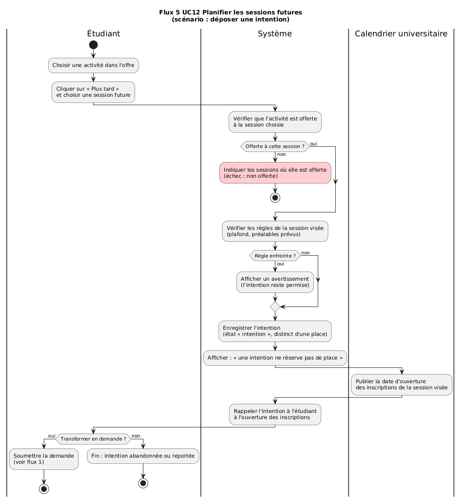

# Section 5 : A2, Cinq flux principaux (diagrammes d'activités)

Les cinq diagrammes ci-dessous décrivent les flux principaux du **système visé**. Chacun est rattaché à un cas d'utilisation (UC) de A1 et à une observation tirée du prototype *Mon cheminement* ou du parcours documenté. Les couloirs distinguent la personne étudiante, le système et les acteurs externes. L'ensemble couvre un flux qui échoue (flux 1), des flux qui dépendent d'un tiers (flux 2 et 3) et des flux soumis à une échéance (flux 2, 3 et 4). Les chemins d'échec sont colorés en rouge.

---

## Flux 1 UC07 Soumettre une demande d'inscription à un cours

- **UC rattaché :** UC07 · Soumettre une demande d'inscription à un cours
- **Couloirs :** Étudiant · Système · Système d'inscription officiel
- **Observation :** Parcours documenté, étape 2 : les préalables et les conflits d'horaire ont été vérifiés manuellement, cours par cours ; un préalable manquant et un conflit ont été découverts tard. Dans le prototype, les cartes de cours indiquent seulement « Inscription libre », les crédits et une charge en h/sem. Dans les sessions exportées par l'équipe, le modèle de données ne contient aucun champ de préalable ni d'horaire pour les activités ; dans une session, IFT1015 et IFT1025 ont été demandés en même temps sans blocage, et dans une autre IFT1015 et IFT2015 ont été obtenus dans la même session.
- **Ce que le prototype fait différemment :** le prototype ne vérifie ni les préalables ni les conflits d'horaire, qu'il ne modélise pas. Dans notre profil C, il a aussi laissé dépasser le plafond : 19 crédits pour un maximum de 15, et 36 h pour une disponibilité de 10 h ; les règles passent au rouge et des avertissements « dépasserait le maximum de crédits » s'affichent, mais les demandes ont été acceptées et confirmées. Notre système effectue quatre vérifications (préalables, horaire, plafond de crédits, places) avant l'envoi et propose une alternative à chaque échec. De plus, dans le prototype, même un cours en « Inscription libre » passe par une demande qui reste en attente ; dans notre système, un cours en inscription libre est confirmé directement par le Système d'inscription officiel.
## Flux 2 UC08 Soumettre une demande d'encadrement (scénario : projet supervisé)

- **UC rattaché :** UC08 · Soumettre une demande d'encadrement (projet, laboratoire, stage). Ce flux en détaille le scénario « projet supervisé »
- **Couloirs :** Étudiant · Système · Encadrant ou partenaire
- **Observation :** Le prototype affiche des places limitées par activité et notifie quand une activité devient complète. Dans les sessions exportées par l'équipe, des demandes expirent : 3 demandes expirées sur 8 envoyées dans une session, 2 sur 7 dans une autre. Dans une troisième session, 3 demandes étaient encore « en attente » à la clôture (semaine 15), sans réponse ni expiration : la personne a terminé la session sans aucune activité confirmée.
- **Observation complémentaire :** Dans notre profil B, une demande de projet auprès d'un superviseur affiché à 36 % de disponibilité a été confirmée en une semaine sans action visible de l'étudiant (un état « offre reçue, non confirmée » existe pourtant, observé dans le profil C) ; le taux de réponse de ce superviseur a ensuite varié avec sa charge (64 % → 38 % → 64 %). Une demande de cours (MEC1310) a disparu entre les semaines 3 et 4 sans notification d'expiration.
- **Ce que le prototype fait différemment :** le prototype a confirmé le projet du profil B sans action visible de l'étudiant (un état « offre reçue, non confirmée » existe pourtant, observé dans le profil C), et laisse une demande expirer, ou rester sans réponse jusqu'à la fin de la session, sans prévenir l'étudiant ni lui proposer d'alternative. Notre système fait accepter l'offre par l'étudiant, prévient de l'échéance et propose des projets semblables après une expiration ou un refus.
## Flux 3 UC11 Demander une exception au département

- **UC rattaché :** UC11 · Demander une exception au département
- **Couloirs :** Étudiant · Système · Administration (département)
- **Observation :** Parcours documenté, étape 4 : un cours souhaité était en conflit d'horaire ; une demande a été envoyée au département et la lettre d'acceptation est arrivée en 2 jours. Dans les sessions exportées par l'équipe, entre 15 et 21 activités étaient complètes à la fin de chaque session (ex. IFT2255, 35 places sur 35) ; le modèle exporté ne contient aucun champ de liste d'attente ni de dérogation.
- **Ce que le prototype fait différemment :** le prototype ne modélise aucune exception (dérogation) ni liste d'attente : une activité complète est simplement perdue. Notre système suit la demande d'exception, affiche le délai habituel de réponse et tient compte de la date limite de modification de l'inscription.
## Flux 4 UC10 Modifier ou annuler une inscription ou une demande (scénario : retrait d'une activité)

- **UC rattaché :** UC10 · Modifier ou annuler une inscription ou une demande. Ce flux en détaille le scénario « retrait d'une activité »
- **Couloirs :** Étudiant · Système · Système d'inscription officiel
- **Observation :** Le prototype affiche la règle « 12 crédits ou plus pour le statut de temps plein » avec un état. Dans les sessions exportées par l'équipe, le calendrier du prototype contient les vraies dates de l'UdeM (modification le 16 septembre, abandon avec frais le 6 novembre), mais des cours ont été confirmés en semaines 11 à 14, donc après ces dates : les échéances sont affichées mais pas appliquées.
- **Observation complémentaire :** Dans notre profil B, en semaine 10, une notification annonce « Échéance aujourd'hui : date limite pour l'abandon (avec frais) ». Dès la semaine 11, chaque activité confirmée affiche : « la date limite d'abandon sans frais est passée : ce retrait entraînerait des frais », mais le retrait reste possible. Par ailleurs, la règle du temps plein (9 sur 12) reste neutre pendant toute la session et ne passe au rouge qu'à la clôture, en semaine 15.
- **Ce que le prototype fait différemment :** les dates limites produisent au mieux un avertissement, jamais un blocage, et le message sur les frais contredit le calendrier ; le temps plein manqué n'est signalé qu'une fois la session terminée. Notre système simule le plan avant le retrait, avertit tout de suite des conséquences (prêts et bourses) et refuse un retrait hors délai.
## Flux 5 UC12 Planifier les sessions futures (scénario : déposer une intention)

- **UC rattaché :** UC12 · Planifier les sessions futures. Ce flux en détaille le scénario « déposer une intention »
- **Couloirs :** Étudiant · Système · Calendrier universitaire
- **Observation :** Dans notre profil C, le bouton « Plus tard » ajoute l'activité à une session future (ex. PSY1075 ajouté à Hiver 2027, compté comme 3 crédits planifiés). La vue « Toutes les sessions » affiche clairement « Seule la session en cours peut faire l'objet de demandes ; le reste est une intention révisable » et « Rien n'est réservé ici […] planifier indique ce que vous visez, pas ce que vous obtiendrez ». Les exigences de chaque session future (cours, projet, séminaire) sont réglées par l'étudiant avec des boutons + / −.
- **Ce que le prototype fait différemment :** le prototype distingue déjà bien une intention d'une place réservée ; notre système conserve ce point fort. En revanche, l'intention est acceptée sans aucune indication sur l'offre de l'activité à cette session, les exigences futures sont fixées par l'étudiant plutôt que par le programme, et les sessions futures ne deviennent jamais actives dans la simulation, si bien qu'aucun rappel n'accompagne l'ouverture des inscriptions. Notre système vérifie que l'activité est offerte à la session visée et rappelle l'intention à l'ouverture des inscriptions.
---

## Couverture des exigences de l'énoncé

| Exigence de l'énoncé (A2) | Où |
|---|---|
| 5 diagrammes d'activités | Flux 1 à 5 |
| Chaque flux rattaché à un UC de A1 | UC07, UC08, UC10, UC11, UC12 |
| Chaque flux rattaché à une observation | Ligne « Observation » |
| Points de décision, chemins alternatifs | Tous les flux |
| Fins en échec | Tous les flux (actions en rouge) |
| Couloirs étudiant / système / externes | Tous les flux |
| Au moins un flux qui échoue | Flux 1 (3 échecs possibles) |
| Au moins un flux qui dépend d'un tiers | Flux 2 (encadrant ou partenaire), flux 3 (administration) |
| Au moins un flux soumis à une échéance | Flux 2, 3, 4 |
| Texte « ce que le prototype fait différemment » | Ligne correspondante sous chaque flux |
| Fichiers sources dans le dépôt | `diagrammes/A2/flux1.puml` à `flux5.puml` |
